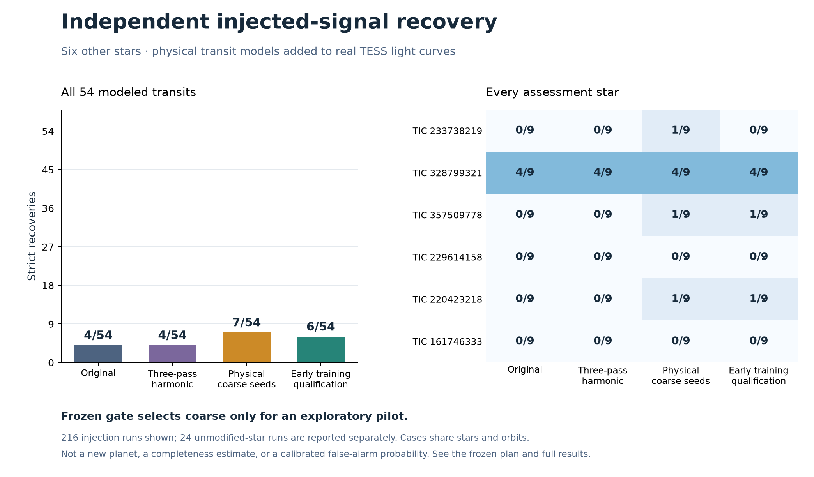

# Complete-pipeline confirmation: limited gain, pilot selected

All 240 frozen runs finished without errors. The simpler `coarse_only` revision
passes the predeclared criteria and is selected for the conditional 100-star
exploratory pilot. No planet or methodological breakthrough is established.

| Unchanged pipeline | Period and timing recovered / 54 | Strict recovery / 54 | Strict plus all screening checks / 54 | Unflagged fits in six unmodified stars |
| --- | ---: | ---: | ---: | ---: |
| Original production | 6 | 4 | 4 | 0 |
| Three-pass harmonic cleaning | 6 | 4 | 4 | 0 |
| Physical duration prior only for coarse seeds | 8 | 7 | 7 | 0 |
| Coarse prior plus early training qualification | 7 | 6 | 6 | 0 |

Both revisions preserve all four strict legacy recoveries. The selected
revision adds one strict recovery on each of TIC 233738219, 357509778 and
220423218, all with one-Earth-radius injections. Early training qualification
adds only the latter two. Both pass the complete-pipeline criteria; the frozen
tie-breaking rule selects the simpler revision's higher recovery count.
Neither comparison produced an unflagged fit in the unmodified-star diagnostics.
Six such stars do not calibrate a false-alarm rate.

The 54 signal models cover six stars, three orbits per star and three radii
per orbit, using limb darkening, noncentral transits and finite-exposure
integration before our processing. The remaining 24 runs process those six
stars without an added transit. Cases share stars and orbital parameters;
they are not 54 independent trials. Absolute sensitivity remains low: the
best revision misses 47 of 54 strict recoveries. This result cannot establish
general completeness or exclude planets around the unsuccessful stars.

These stars were not used in the five-star method development, and their
revised-pipeline outputs were unseen when the confirmation was frozen. Their
original survey results had previously been inspected. The case templates
come from the unexecuted physical-duration assessment; that earlier 180-run
experiment remains unused because its own prerequisite failed. The failed
incremental-gain gate from the qualification ablation also remains failed.
This separately declared experiment tests complete pipelines, without changing
either earlier decision after its results.

The [real TOI-700 control](../../calibration/revised_pipeline/FINDINGS.md)
also checks preservation of an existing known-planet recovery. All
four methods retain TOI-700 d strictly; none retains TOI-700 e among two fits.
The selected revision has slightly lower fitted control scores than production.
These checks justify a bounded pilot, not universal superiority or scientific
novelty. Stellar-duration priors and harmonic detrending are established ideas.

Inspect the [frozen protocol](../../../docs/EXPERIMENT_PIPELINE_CONFIRMATION.md),
[case and source manifest](plan.json), [all run outcomes](results.json), and
[artifact audit](audit.json). The audit passes 2,205 checks of source/input
hashes, exact case identities, sector separation, frozen ephemerides and
recovery accounting. Full local fits remain under `results/pipeline_confirmation/`.
Reproduction commands are `python scripts/pipeline_confirmation.py --workers 3`,
`python scripts/audit_confirmation.py` and `python scripts/plot_confirmation.py`
after restoring the frozen inputs and experiment dependencies.
