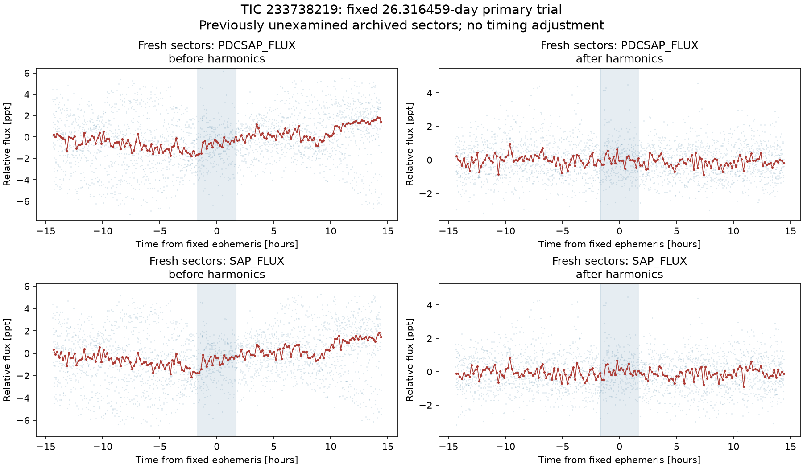
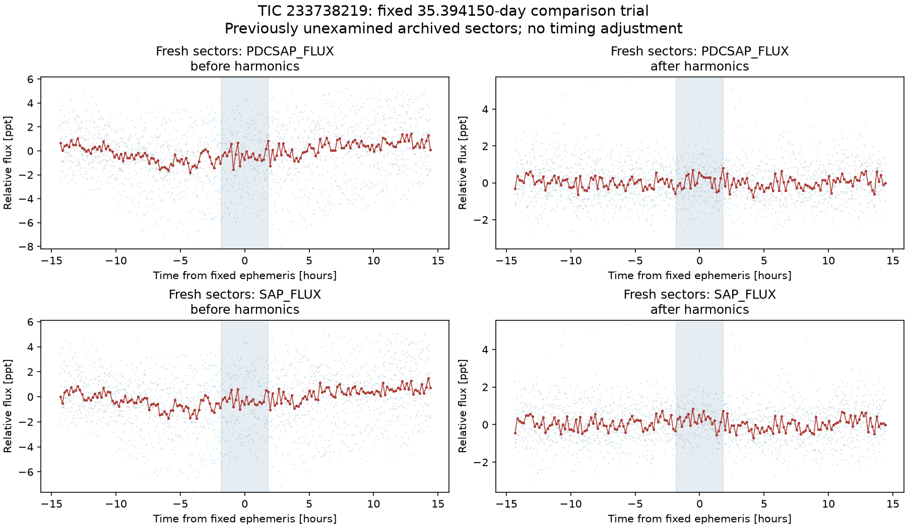

# Fresh archived-sector follow-up: both trial fits fail recurrence

Both unexplained TIC 233738219 fits fail the frozen recurrence screen in 21
previously unused observing sectors. Neither is retained as a credible periodic
planet trial. There is no new planet candidate or discovery. This result does
not establish that the star has no planets.

The [plan](plan.json) and [protocol](../../../docs/FRESH_SECTOR_FOLLOWUP.md)
were [published before download](https://github.com/darshanahirrao/nearby-exoplanet-search/commit/98a83917fa4f25cbb6cf4f5ad448b480952d35f9).
They select every unused sector in the project's existing 120-second SPOC
product snapshot. All 21 products downloaded successfully. The original 18
sectors remain unchanged; new inputs have no shared raw timestamps or sector
identifiers with them. The data yield 66,899 processed PDC points and 66,956
SAP points. Both trial ephemerides and their durations remain exactly fixed.

| Fixed trial period | Measurable fresh PDC events: original / quadratic | Fresh original PDC score | Fresh quadratic PDC score | Frozen recurrence screen |
| --- | ---: | ---: | ---: | --- |
| 26.316459 days, primary | 15 / 14 | −0.60 | 0.06 | Failed |
| 35.394150 days, comparison | 13 / 13 | −0.80 | −2.73 | Failed |

For the primary trial, the fresh quadratic depth is **4 ± 69 ppm**, compared
with 866 ± 128 ppm in the originally examined held sectors under the same
continuum prescription. Those errors are nominal; the conclusion rests on the
failed recurrence across the disclosed checks, not a claimed Gaussian
false-alarm probability. Fresh SAP scores are also negative after harmonic
filtering. Before filtering, broad variations produce positive local scores,
but no isolated residual dip remains at the fixed timing after filtering.

A [post-follow-up sensitivity diagnostic](injection_diagnostic/FINDINGS.md)
tests the possibility that processing simply erased a signal of the originally
estimated size. It adds either the fitted box or a circular limb-darkened
transit of the inferred radius to the same fresh PDC observations before this
project's processing. The supplied timing and measurement window remain fixed.

| Trial | Added model | Original score after processing | Quadratic score after processing |
| --- | --- | ---: | ---: |
| 26.316459 days | Fitted box | 10.29 | 9.35 |
| 26.316459 days | Circular physical transit, 0.79 Earth radii | 7.23 | 6.74 |
| 35.394150 days | Fitted box | 12.72 | 8.79 |
| 35.394150 days | Circular physical transit, 0.89 Earth radii | 8.45 | 5.12 |

All four selected injections pass the nominal recurrence requirements while
the original observations fail. The controls were specified **after** observing
that failure and are disclosed as retrospective sensitivity checks, not a
blind experiment or general completeness estimate. They support rejecting these
two fixed periodic fits; they do not prove a unique cause for the original
fluctuations or establish absence of planets in other configurations.

The [audit](audit.json) passes 213 checks with zero failures, including the
published plan, original and new input hashes, raw timestamp separation,
exact ephemerides, all phase classes and independently recomputed event-score
arithmetic. The [complete results](results.json), individual event measurements,
download receipts, and all harmonic-model records are public. The original
shortlist method-adoption gates remain failed and no fresh survey with those
failed revisions is started. The distinct-star search count remains unchanged.

