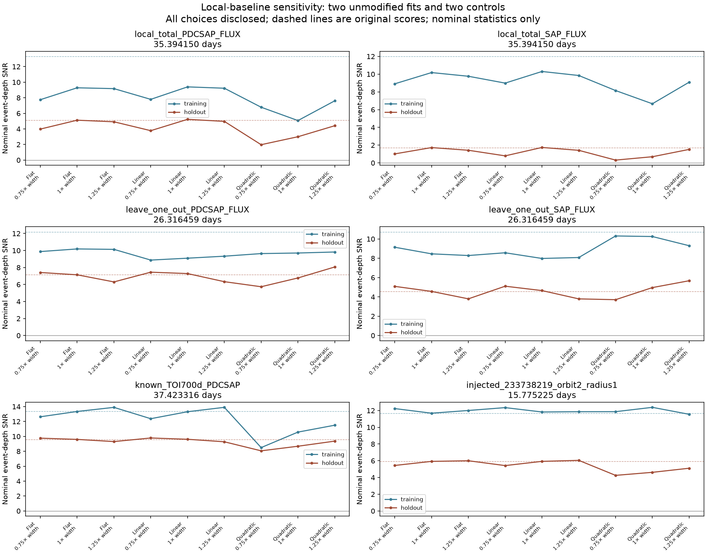

# Local baselines: 26-day signal persists, interpretation unresolved

The unmodified 26.316459-day trial remains above nominal event-score thresholds
of 7 in training and 5 in held sectors under all nine local-baseline choices.
This check does not establish a planet, source identity or calibrated significance.
The 35.394150-day trial is more sensitive to the baseline choice and remains
unverified. No search or method-adoption criterion changes.

The [frozen diagnostic plan](plan.json) specifies flat, linear and quadratic
continuum fits, each at 0.75, 1 and 1.25 times the original outer baseline radius.
Fits exclude a protected region extending one supplied duration on each side of
the center and require at least four samples on each flank and three inside
the event. Uncertainty in the fitted continuum is propagated into the average
event depth. All period, epoch and duration values come from the saved training
fits; there is no period search here.

| PDC case | Original training / held score | Range across nine choices: training | Range across nine choices: held |
| --- | ---: | ---: | ---: |
| Unmodified 26.316459 days | 12.19 / 7.14 | 8.88–10.18 | 5.74–8.06 |
| Unmodified 35.394150 days | 13.30 / 5.12 | 5.08–9.40 | 1.98–5.23 |
| Known TOI-700 d control | 13.36 / 9.60 | 8.50–13.90 | 8.07–9.79 |
| Physical injection control, TIC 233738219 | 11.68 / 5.93 | 11.55–12.38 | 4.25–6.05 |

Requiring two-sided coverage excludes two of the eleven original 26-day
training events and one of the seven 35-day training events. The four and five
held events respectively remain measurable. The 26-day held depths at the
original outer radius are 782 ± 109 ppm for a flat continuum, 798 ± 110 ppm
for a linear continuum, and 866 ± 128 ppm for a quadratic continuum. Thus
allowing local curvature does not eliminate this signal. SAP remains weaker,
with held scores ranging from 3.71 to 5.67 across the same choices; SAP and PDC
share detector data.

The 35-day PDC held depth changes from 487 ± 95 ppm for a flat continuum to
334 ± 111 ppm for a quadratic continuum at the original outer radius. Its
scores are below 5 for all three quadratic widths. **This is not sufficient
to classify it as an artifact:** two quadratic choices also put the physical
injection control below 5. That control uses an already exposed one-Earth-radius
limb-darkened, exposure-integrated signal added before the original processing,
with the saved recovered timing. These controls do not measure general
sensitivity, and the stronger real-planet control cannot alone establish
preservation of fainter planets.

Separate left-only and right-only flat baselines, using the same covered
26-day held events, give nominal scores of 4.54 and 8.98. This asymmetry and
the visible nearby flares remain concerns. Polynomial covariance assumes the
reported point errors and does not model correlated stellar noise or continuum
misspecification. This analysis has reused already inspected sectors throughout.

The [complete summary](summary.json) and six individual result files retain all
108 fixed-timing combinations, including excluded events and one-sided checks.
The [driver](../../../scripts/vet_local_baselines.py) passes 206 direct numerical
checks against the original saved scores and event estimates. Three additional
software tests recover a known transit on a curved continuum, check uncertainty
against 500 independent noise realizations, and reject a missing flank. The
complete 33-test suite passes. These are software and diagnostic controls,
not planet validation or evidence of a new algorithm.

Reproduce with `python scripts/vet_local_baselines.py`.

The stronger 26-day trial proceeds to exploratory source localization using
the two held sectors containing its strongest events. Neither trial is promoted.

