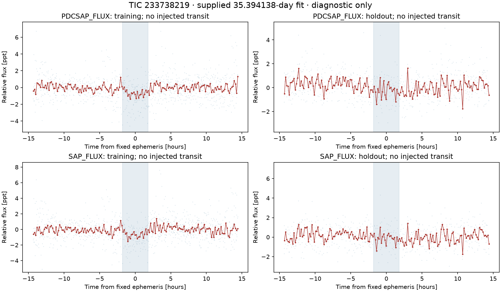
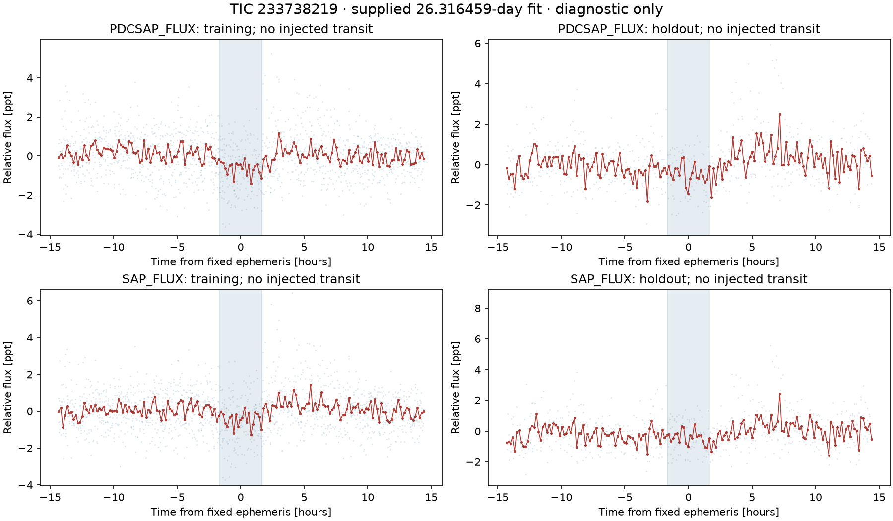

# Unmatched development fits checked on uninjected observations

Two periods selected during the TIC 233738219 injection experiment also show
positive local depth statistics in the original observations. They are not
the injected planet and are not new or validated planet candidates. Their
ephemerides were supplied by the exposed development experiment rather than
selected independently here.

| Supplied period | PDC training SNR | PDC held-sector SNR | SAP training SNR | SAP held-sector SNR |
| --- | ---: | ---: | ---: | ---: |
| 35.394138 days | 13.303 | 5.054 | 11.991 | 1.639 |
| 26.316459 days | 12.187 | 7.142 | 10.729 | 4.569 |

These are nominal fixed-ephemeris event-depth statistics using the original
error floor and identical three-pass harmonic processing. SAP and PDC share
pixels, so they are not independent observations. The weaker SAP statistics
alone neither reject a planet nor prove a PDC artifact.

The training folds contain broad depressions. The held-sector folds have
substantial scatter and neighboring structure rather than a compelling,
isolated transit profile. Visual inspection does not establish a planetary
shape or identify the source. Neither trial is promoted. Aliases, individual
events, source localization and current catalogues remain unresolved.

The [summary](summary.json) records the supplied fits, source and telescope
hashes. The individual JSON files contain all event depths and uncertainties.
Reproduce with `python scripts/check_portfolio_extras.py`. This diagnostic does
not change the completed method experiment or any screening threshold. The
exact final unmodified local-total fit has period 35.394150 days, slightly
different from the supplied smoke-fit period used in this diagnostic.

A subsequent [rotation and individual-event review](../portfolio_rotation/FINDINGS.md)
uses both exact unmodified ephemerides. It finds substantial short-period
variability and baseline concerns, but does not resolve either residual signal.
