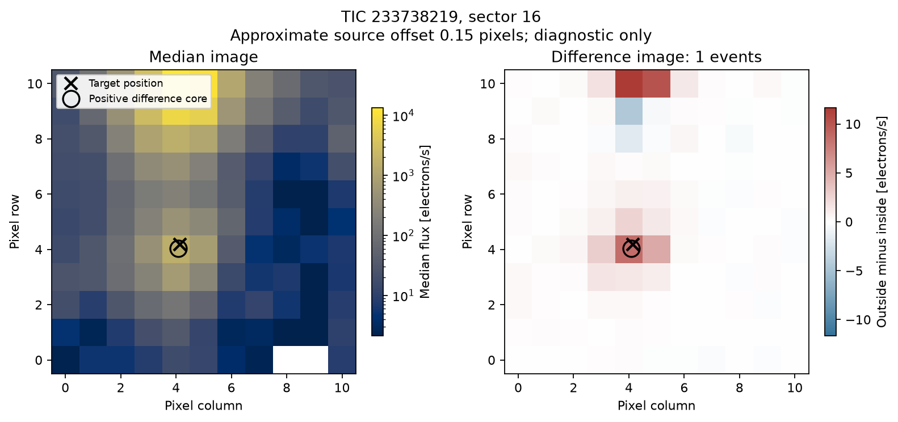
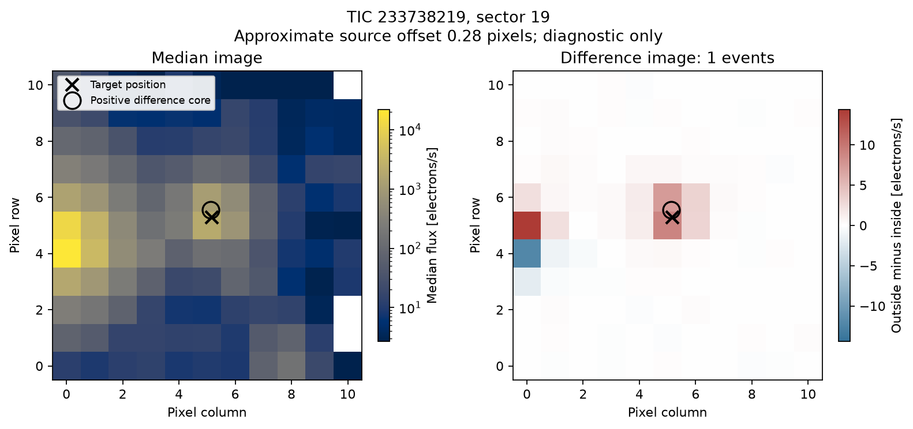

# Two-sector source diagnostic for the 26.316459-day trial

Difference images from sectors 16 and 19 show a changing component close to
TIC 233738219. The approximate positive-core offsets are 0.15 and 0.28 pixels.
These images do not identify a clearly separated background source as the
dominant component, but **do not isolate or validate a planetary transit**.

Both selected sectors contain one of the strongest previously examined held
events, at BTJD 1744.260257 and 1823.209634. This selection is disclosed; the
images are not independent new photometric detections. The raw target pixels
retain the star's strong 1.316-day variability, which can itself produce the
near-target difference. A weaker blended source is not ruled out. The original
pixel-error estimate also excludes correlated errors, and the positive-core
centroid is not a precise PRF or astrometric fit.

[NASA's difference-imaging design note](https://ntrs.nasa.gov/citations/20190029148)
describes the more complete treatment of difference images, PRF centroids,
uncertainties and offsets used in data validation. This project's simple
diagnostic does not implement all those steps.

The [download manifest](download_manifest.json), [exact results](result.json)
and [export hashes](export.json) preserve the two products and their provenance.
Numerical difference images and nominal pixel errors are included as NPZ files.
No original search, trial ephemeris or experimental gate changed.

```sh
python scripts/download_pixels.py --tic 233738219 --sectors 16 19
python scripts/pixel_vet.py --tic 233738219 --period 26.316459215610013 --epoch 1691.6273382310633 --duration 0.13943435639852114
```

The commands reproduce the diagnostic under `results/233738219_pixels` when
only the two specified target-pixel products are present for this target.




