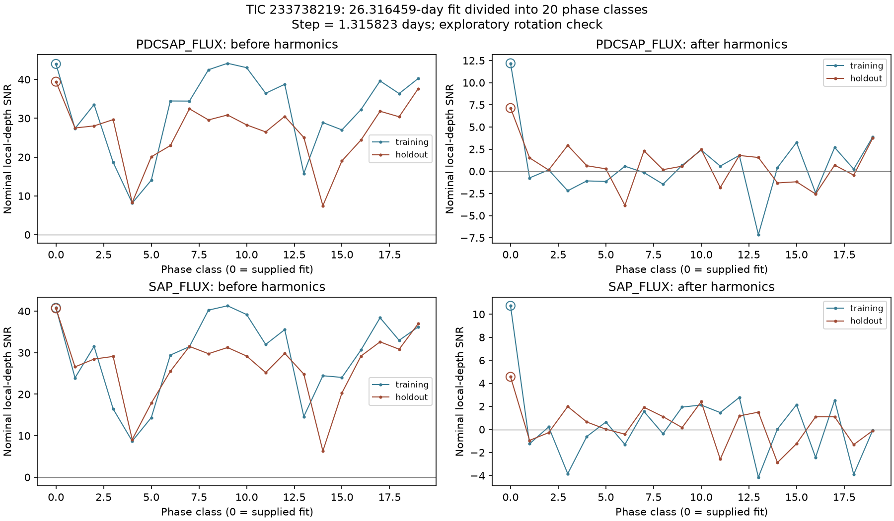
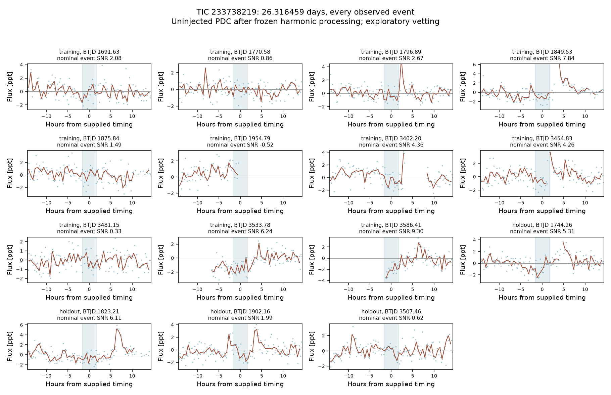
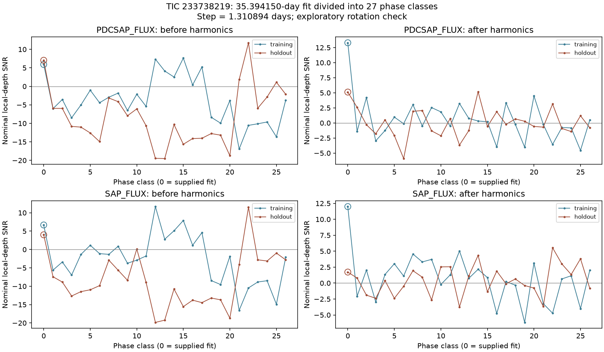
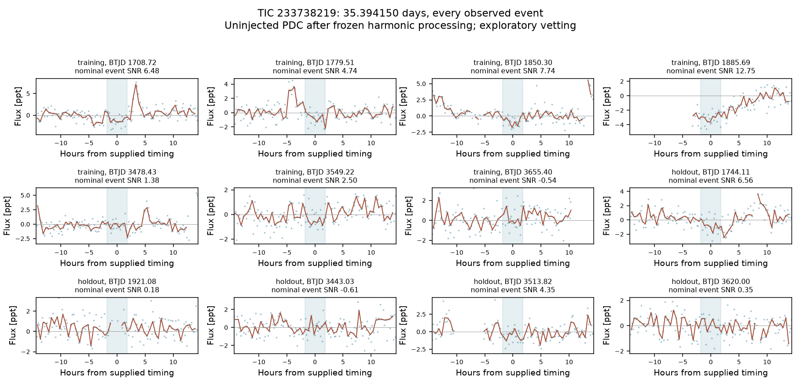

# TIC 233738219: rotation and individual-event review

**Subsequent outcome:** both fits [fail the fixed-ephemeris check in 21 unused
sectors](../fresh_sector_followup/FINDINGS.md) and are not retained as credible
periodic planet leads. The initial rotation evidence below remains inconclusive
on its own and does not identify the precise source of the old fluctuations.

Neither unmodified trial is promoted to a planet candidate. The rotation check
raises a specific contamination concern for the 26.316459-day fit but does not
by itself establish that the residual is an alias. The 35.394150-day fit is also
unverified. The failed method-adoption gates remain failed.

[Stelzer et al. (2022), Table 1](https://arxiv.org/pdf/2207.03794) report a
rotation period of 1.316 ± 0.010 days for this star. Dividing the two exact
unmodified periods by their nearest integer ratios to that published value
gives 1.315823 days (20 rotations) and 1.310894 days (27 rotations). Approximate
agreement with a published rotation period is a hypothesis, not proof of an alias.

We checked every phase class at these supplied subdivisions in uninjected
PDCSAP and SAP observations, both before and after the original three-pass
harmonic filter. The before-filter series still uses the original 1.5-day median
trend. The supplied period, epoch and duration remain fixed. No alternative
long-period search or threshold adjustment is performed.

For the 26.316459-day fit, all 19 other phase classes have positive depth scores
before harmonic filtering, in both data products and both sector groups. Their
median nominal PDC scores are 34.43 in training and 28.04 in holdout, consistent
with strong short-period variability. After filtering, the median other-class
scores fall to 0.24 and 0.58. **The supplied class remains the strongest in both
groups**, at 12.19 and 7.14. The comparison therefore cannot dismiss the residual
as ordinary identical dips on every rotation. SAP gives the same qualitative
pattern, with weaker held-sector support (4.57).

The 35.394150-day fit does not show the same all-positive rotation pattern.
After filtering its PDC scores are 13.30 in training and 5.12 in holdout; its
SAP held-sector score is 1.73. An intervening phase class has a slightly larger
PDC held-sector score. This does not identify the source or establish a false
alarm probability.

All 15 measurable 26.316459-day events and all 12 measurable 35.394150-day events
are plotted, including weak and negative events. Several stronger scores lie
near flares, broad slopes or gaps. For example, the 26-day held events near
BTJD 1744.26 and 1823.21 have bright structure within the local baseline window;
the training event near BTJD 3586.41 lacks a complete preceding baseline.
These observations motivate checking baseline sensitivity and coverage. They
are visual concerns, not an established causal explanation of every dip.

Fresh exact-TIC queries on 2026-09-07 found zero matches in the ExoFOP TOI,
ExoFOP CTOI and NASA composite confirmed-planet tables. Successful query
receipts and response hashes are in [the summary](summary.json). These checks
do not prove novelty, exhaust other catalogues or exclude nearby sources.

The [reproduction script](../../../scripts/vet_portfolio_rotation.py) saves all
phase scores, individual event measurements, helper hashes, input FITS hashes,
and the exact source fits. Its 16 direct checks reproduce the original event
score for the unshifted class across two trials, two data products, two stages
and two sector groups. SAP and PDC share pixels. Nominal local-depth statistics
do not model all correlated variability and are not calibrated significance.
The already examined holdout sectors are not new independent validation data.

Reproduce with `python scripts/vet_portfolio_rotation.py`.

A subsequent [local-baseline sensitivity check](../local_baseline_sensitivity/FINDINGS.md)
retains the 26-day PDC signal under all nine specified continuum choices.
The 35-day signal weakens, but some choices also weaken the injected control;
neither result settles the astrophysical interpretation.

